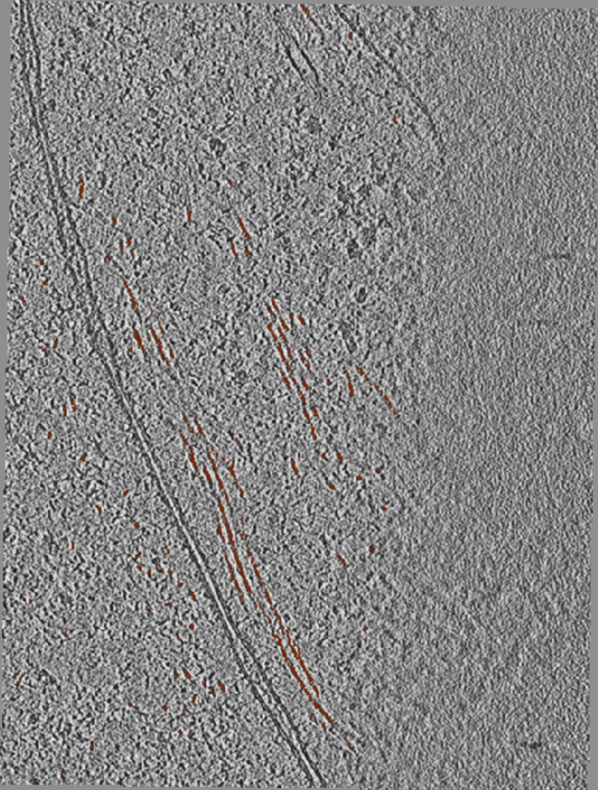
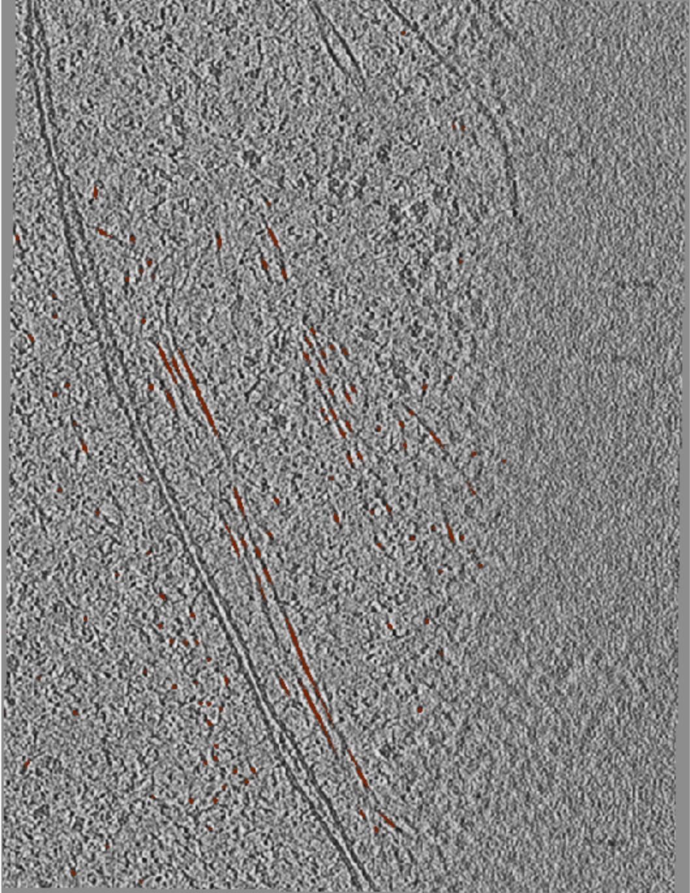
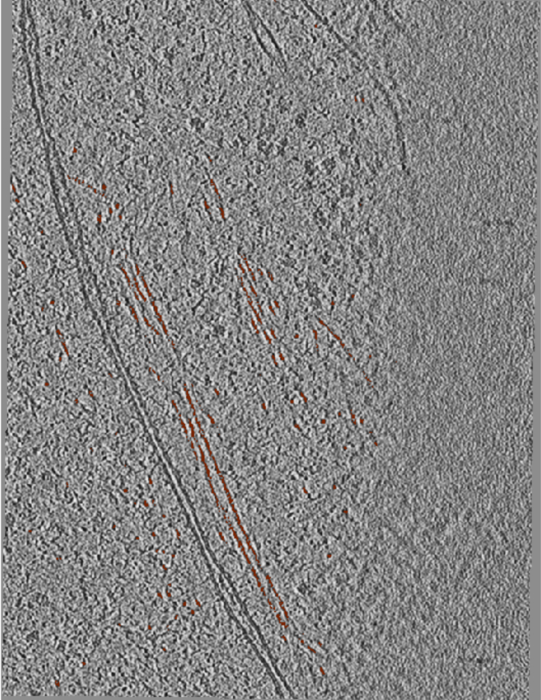

# Project #21: Automated segmentation of actin filaments in intact cells (EM)

## Overview

The goal of the project was to segment actin filaments in cryo-ET tomograms, building a model that can generalise to future tomograms to produce quality segmentations. This project presents a significant challenge both in terms of the segmentation task and data acquisition. The filamentous structure of actin, along with the technical challenges of working with cryo-ET tomograms, such as, low SNR and distortions caused by the missing wedge effect and tomogram reconstruction errors, make the segmentation task particulary challenging. Data acquisition is also technically difficult and time consuming, however, in order to generalise across tomograms many examples are required. Another difficulty arises from ground truth generation which is also difficult and time consuming.Taking into consideration all the aforementioned challenges and their time scales this project took shape as a series of consultations. Below is a description of the insights gained and the steps taken to progress towards a cryo-ET actin segmentation model.

## Example Tomogram

The below example shows a cropped tomogram with actin filaments labelled in brown.

## Ground truth generation

The first stage of the project was ground truth label generation, this presented a challenge as the manual annotation of a large number of tomograms is prohibitively time consuming. We therefore opted for a semi automated label generation process using the cylinder and trace correlation functionalities in the Amira software to generate initial labels, which could then be manually cleaned to remove spuriously labelled objects such as tomogram edges, membranes or microtubules. While much faster than purely manual annotation, the process is still time consuming hence the need for a fully automated Actin segmentation model. The Quality of the ground truth was also discussed during the project, for while the semi automated label generation was more time efficient, it potentially led to some misleading and incorrect pixel annotations. We therefore investigated if any substantial differences in performance were observed when using fully manually annotated ground truth. This was done by manually annotating a small subset of sub tomograms and then comparing the predictions of models trained using the manual annotations and  the semi automated annotations. We also investigated further processing the cleaned Amira annotation, by finding the intersection between an otsu thresholded image and the amira annotation.

### Comparison of Label Generation Methods

The images below compare the labels generated using Amira and Dragonfly software. 

