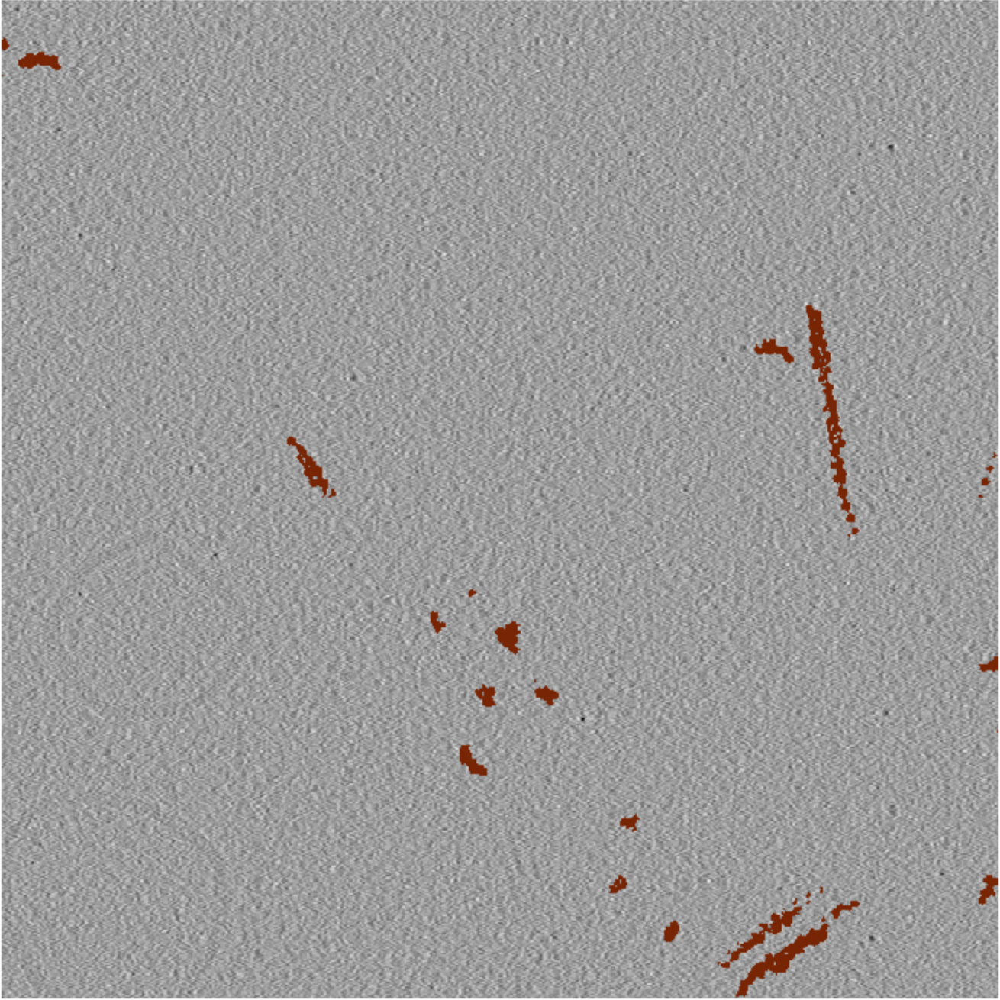
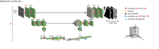

# Project #21: Automated segmentation of actin filaments in intact cells (EM)

## Overview

The goal of the project was to segment actin filaments in cryo-ET tomograms, building a model that can generalise to future tomograms to produce quality segmentations. This project presents a significant challenge both in terms of the segmentation task and data acquisition. The filamentous structure of actin, along with the technical challenges of working with cryo-ET tomograms, such as, low SNR and distortions caused by the missing wedge effect and tomogram reconstruction errors, make the segmentation task particulary challenging. Data acquisition is also technically difficult and time consuming, however, in order to generalise across tomograms many examples are required. Another difficulty arises from ground truth generation which is also difficult and time consuming.Taking into consideration all the aforementioned challenges and their time scales this project took shape as a series of consultations. Below is a description of the insights gained and the steps taken to progress towards a cryo-ET actin segmentation model.

## Data

In large part the ability of a model to generalise to new unseen data is dependent on the variability and distribution of data observed during training. Over the course of the project a large time investment has been put into obtaining and annotating (semi-automated, more detail below) more tomograms bringing the total to 83 tomograms binned by 4 – pixel size of 13.48 Å and filtered by [spectrum matching](https://github.com/ZauggGroup/DeePiCt/tree/main/spectrum_filter).

### Example Tomogram

The below example shows a cropped tomogram with actin filaments annotated in brown.

### Simulated Tomogram

We also discussed utalising simulated data and obtained 400 simulated tomograms. Further investigation is required to determine the practical advantages of using such simulations as additional training data, but we beilive they at least provide a useful rescourse to investigate ground truth generation as discussed in the next section. The below example shws one such simulated tomogram with annotated actin filaments.

## Ground truth generation

The first stage of the project was ground truth label generation, this presented a challenge as the manual annotation of a large number of tomograms is prohibitively time consuming. We therefore opted for a semi-automated label generation process using the cylinder and trace correlation functionalities in the Amira software to generate initial labels, which could then be manually cleaned to remove spuriously labelled objects such as tomogram edges, membranes or microtubules. While much faster than purely manual annotation, the process is still time consuming hence the need for a fully automated Actin segmentation model. Another drawback to the Amira annotation pipeline is that it relies upon fitting cylinder objects to the filamentous structures in a tomogram, however due to the low SNR, reconstruction errors and the orientation of the actin in the tomogram this can lead to a mismatch between the signal observed in the tomogram and what is being annotated as actin. In order to try and reduce the number of false positive labels we investigated further processing the cleaned Amira annotation, by finding the intersection between an otsu thresholded image and the amira annotation.

### Comparison of Label Generation Methods

The images below compare the labels generated using the semi-automated Amira annotation pipeline and the manual annotation pipeline Dragonfly pipeline. 

The amira labels and the manual dragonfly labels produced similar groundtruth as highlilghted in the example cropped tomograms above, however,in general the amira pipeline has a tendency to over annotate realtive to the manual annotations. The Quality of the ground truth was also discussed during the project, for while the semi automated label generation was more time efficient, it potentially led to some misleading and incorrect pixel annotations. We therefore investigated if any substantial differences in performance were observed when using fully manually annotated ground truth. This was done by manually annotating a small subset of sub tomograms and then comparing the predictions of a model trained using the manual annotations with a model trained using the semi automated annotations. We did not observe any major difference betweent he performance of the models, however due to the prohibitively slow process of manual annotation we could not train the models on many tomograms. Another approach being investigated is to rely on simulated data, where accurate groundtruth is inherently available, this would allow a larger set of data to be considered for the comparison as only the faster semi-automated amira labelling is required to be produced.

## Models

For all the Actin segmentation predictions so far the project has been relying upon training a supervised 3D U-net, using the [DeePiCt](https://github.com/ZauggGroup/DeePiCt) repository to provide the architecture and training framework. DeePict provides a convinient and simple to use implementation of the U-net architecture that is controlled via config files, allowing project collaborator to define and train their own U-net models. An example of one such config file is shown in this repo.

## Model Hyperparameters

We investigated tuning the hyperparameters of the U-net varying the depth, number of initial features, learning rate and augmentations applied during training. All these experiments were carried out by training on a set of 28 tomograms and testing on a held out test tomogram. 

### Evaluation metric
Evaluation of the segmentation performance was also a key aspect of the challenge and we discussed using more appropriate segmentation performance metrics for filamentous structures, such as the centerline dice score. A good resource to discover and evaluate suitable performance metrics is [metrics reloaded](https://metrics-reloaded.dkfz.de/).

## Conclusion

This project mostly focused on consulting and providing image analysis support. We advised on the gathering of additional data and suitable generation of ground truth annotations, additoinally we helped to set up a pipeline based on DeePict to train and test a supervised U-net based model to perform segmentation and advised on further hyperparmeter tuning. As it currently stands a large and diverse training set of real tomograms has been obtained along with simulated data, a pipeline for semi-automated groundtruth annotation set up and a pipleline for supervised segmentation setup and tested. Actin filaments in cryo-ET tomograms remain a challenging segmentation task, but a strong basis for future work has been established.

